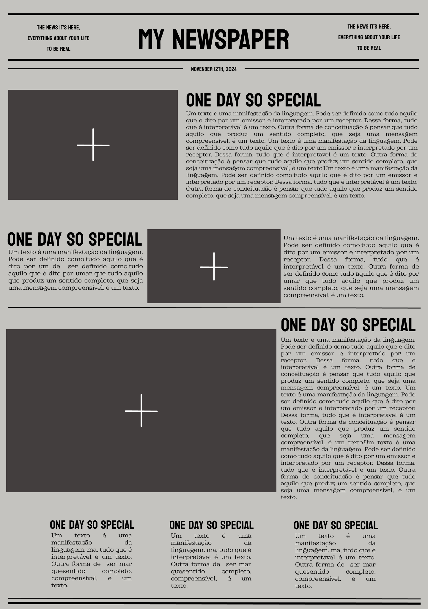

<h1 align="center"> NEWSPAPER </h1>

  <a href="#projeto ">Projeto</a>&nbsp;&nbsp;&nbsp;|&nbsp;&nbsp;&nbsp;
  <a href="#tecnologias">Tecnologias</a>&nbsp;&nbsp;&nbsp;|&nbsp;&nbsp;&nbsp;
  <a href="#layout">Layout</a>

  

## PROJETO
....

## LAYOUT

Visualize o Layout do projeto através [DESSE LINK](https://www.figma.com/design/AgSpkOwBb7mrpJM3hIM3Do/My-Newspaper?node-id=4-4&t=qNIk3VV5QUAbMSC1-1). E para acessá-lo é necessário ter um conta no [FIGMA](https://figma.com).

 

### TECNOLOGIAS 

   

   

   
  
   

   

   

