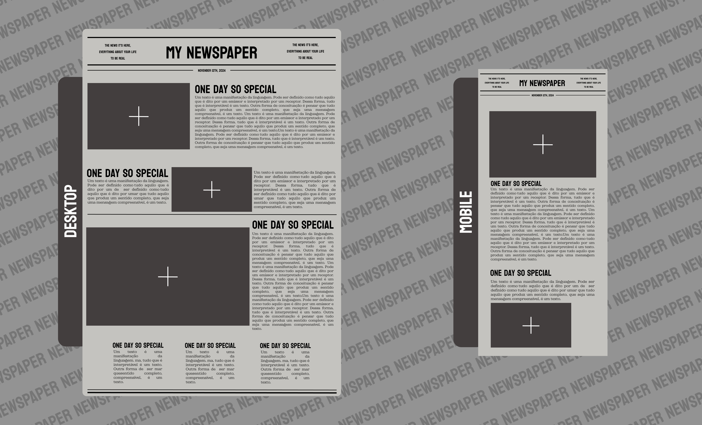

<h1 align="center"> NEWSPAPER 📰</h1>

  <a href="#projeto ">Projeto</a>&nbsp;&nbsp;&nbsp;|&nbsp;&nbsp;&nbsp;
  <a href="#tecnologias">Tecnologias</a>&nbsp;&nbsp;&nbsp;|&nbsp;&nbsp;&nbsp;
  <a href="#layout">Layout</a>&nbsp;&nbsp;&nbsp;|&nbsp;&nbsp;&nbsp;
  <a href="#estrutura-de-pastas">Pastas</a>

  

## PROJETO
"My Newspaper" é um projeto web que tem objetivo permitir que o usuário crie sua própria página de jornal, nela ele poderá por fotos de momentos icônicos da sua vida e comentar sobre esses momentos... Ou seja fazer desses momentos notícias de um velho jornal.

Esse projeto vai funcionar da senguinte forma, existirá campos editaveis, tanto para fotos como para a edição de texto e título, possibilitando o usuário se divertir e por sua criatividade e histórias no papel, ou melhor na tela.

## LAYOUT

Visualize o Layout do projeto através [DESSE LINK](https://www.figma.com/design/AgSpkOwBb7mrpJM3hIM3Do/My-Newspaper?node-id=4-4&t=qNIk3VV5QUAbMSC1-1). E para acessá-lo é necessário ter um conta no [FIGMA](https://figma.com).

 

### TECNOLOGIAS 

   

   

   
  
   

   

   

   

   

 

### ESTRUTURA DE PASTAS

  /asset -------------------- Arquivos de conteúdo primário  
  /CSS ---------------------- Arquivos de mapeamento e converção do Sass   
  /docs --------------------- Documentação do projeto  
  /module ------------------- JavaScript Functions Modules  
  /node_modules ------------- Modules Bootstrap  
  /src ---------------------- Código fonte   

